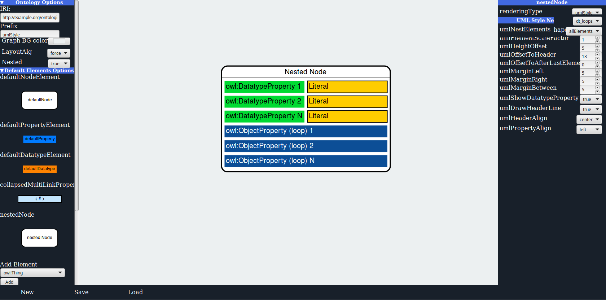
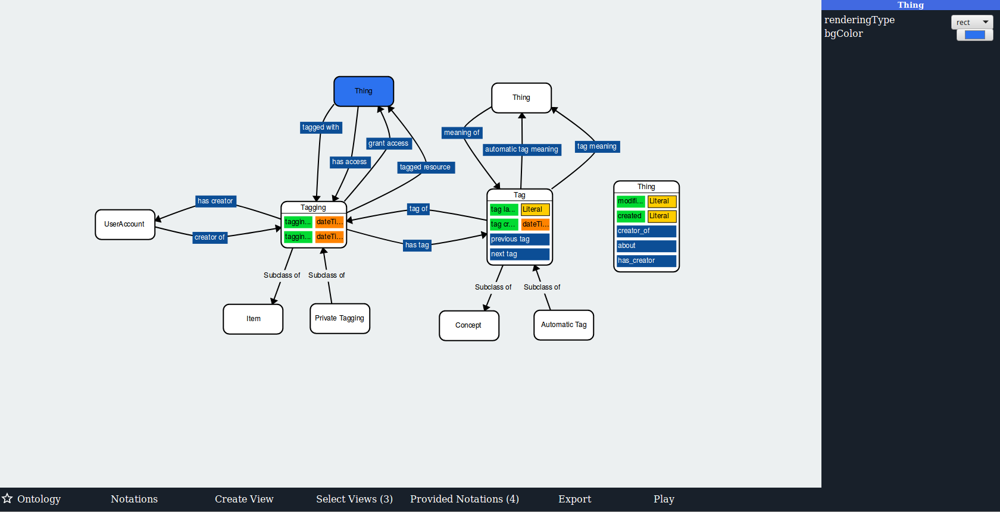

#  GizMO Prototypes ISWC 2019
 <b><u>Note:</u></b> Both prototypes provide features to export as TTL, however 
  converting TTL files to JSON is not supported in this release version for the reviewers.
  A converter is implemented and was used to create the JSON files.
  
 <a href=https://gizmo-vis.github.io/gizmo/notationEditor/index.html> GizMO Notation Editor </a>
 
  
  
 <a href=https://gizmo-vis.github.io/gizmo/visualizationFramework/index.html> GizMO Visualizaton Framework </a> 
 
# GizMO Core Ontology
 The GizMO core ontology can be found TODO!
 
# GizMO Notation Editor
 
 

The user interface is divided into four parts, as shown in the screenshot.

1) The menu on the left side provides the selection of different OWL constructs and options for the notations.
2) The canvas area in the center depicts a selected OWL construct with its assigned visual properties and corresponding rendering primitives.
3) The menu on the right side provides options for customization of the values for the visual properties.	
		All changes are directly reflected in the canvas and the left side menu, applying the WYSIWYG paradigm.
4) The menu at the bottom enables to load and save notations (here as JSON files). 

## Description

This repository is a temporary solution due to the double blind review process of ISWC 2019.
 
## Usage
1) Goto  <a href=https://gizmo-vis.github.io/gizmo/notationEditor/index.html> GizMO Notation Editor </a>
2) Create notation and save it as JSON. 
 * In this version we do not provide a backend to parse *.ttl files, however
 you the functionality is implemented and you can take a look at the resulting ontology. 
 * You can also load your designed annotation ontologies (as JSON) files 
 
## Example Notations
Example notations (as *.ttl and *.json) can be found  <a href=https://github.com/gizmo-vis/gizmo/tree/master/notationEditor/exampleNotations> here </a>

  
  
# GizMO Visualization Framework
 
 
 ## Description 
  Navigation Menu:
  * Ontology
    * Provides as set of already converted ontologies (Example Ontology and Muto)
    * Provides as set of already converted containers (Example Ontology and Muto)
        * Containers provide some views             
 * Notations
    * A set of already converted notations
    * allows to load custom notations (as JSON)
    
 * Create View 
    * Append view will open a dialog and ask the user for a prefix and iri for the new view
    (defaults are view_index and http://example.org/view_index)
 * Select View (Optional)
    * Allows to switch between loaded views
 * Provided Notations(Optional)
     * Allows to switch between loaded notations (also when custom notations are stored in the container)
  
 * Export 
     * Provides a dialog where the loaded notations and views are listed. 
     Setting the checkboxes will add those to the final container.

     * Separated Files: If checked will create a zip file with all ontologies separated.
      A container ontology will be created which includes all other ontologies using < owl:imports >
      Additionally a 'Show Content' button will be added to notations and views. 
      
        * To create a single file container uncheck this box.

    NOTE: Resulting ontologies will be provided as ttl
    
      

 * Play / Pause
    * Actives or stops the force directed layout 

Right sidebar:
  * Provides customization for rendering glyphs on a local level (detached from the notation)
    * note
        * we provide here only the local modification of background colors and shapes
        * for nested node representations the rendering type should not be changed to circle or ellipse (not implemented yet)
         
    
     
 ## Usage
 1) Goto  <a href=google.com> GizMO Visualization Framework</a>  
    This will load an example graph and the default notation.
 
 2) Select an ontology of interest and visualize it with different notations
 3) Select a container and see what notations and views are already provided in the container :)
    
